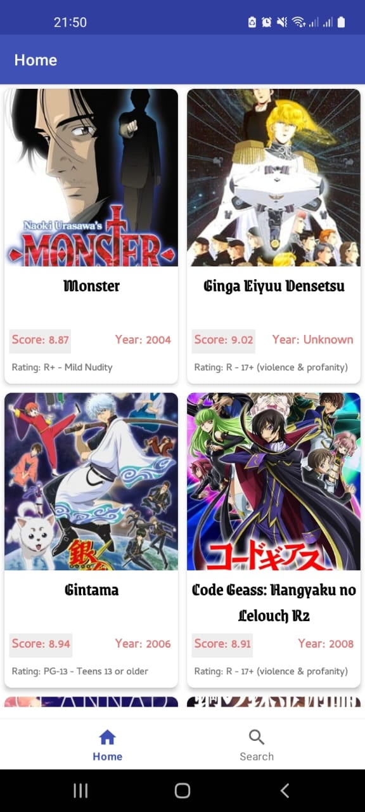
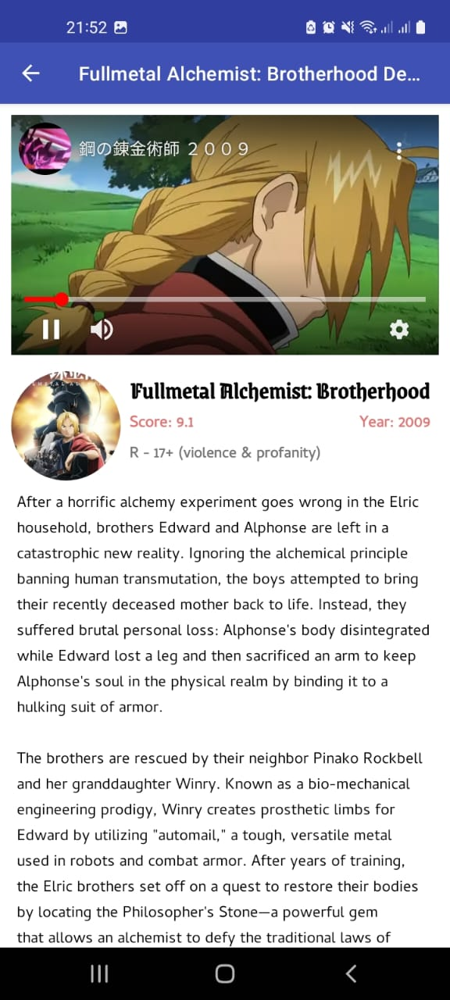
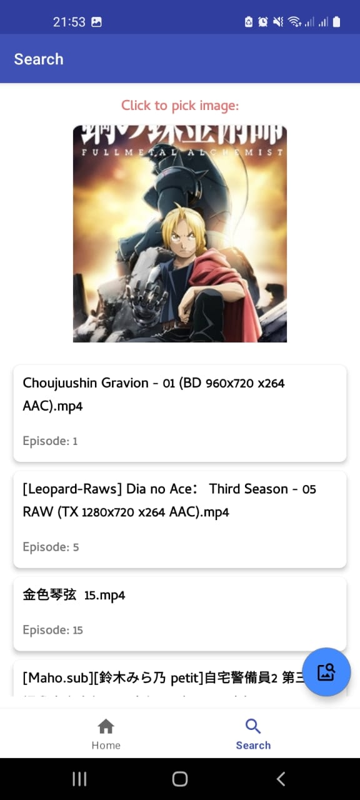

# Anime Universe
This is an app which fetches and lists top 25 animes.

# Tech-Stack

* Language: Kotlin.
* Software: Android Studio, Git.
* Architecture: MVVM design principles with (LiveData, ViewModel, Databinding).
* Room: SQLite database for Android.
* Coroutines: Light weight threading for asynchronous programming.
* Retrofit: A type-safe HTTP client (networking) for Android and Java.
* Moshi: For parsing the JSON format.
* Glide: An image loading and caching library for Android focused on smooth scrolling.
* Material Design Material: Design system created by Google to help teams build high-quality digital experiences.

# API-Documentation
*  API to fetch anime: https://api.jikan.moe/v4/top/anime; Documentation: https://docs.api.jikan.moe/#tag/top
*  API to upload images and display data: https://api.trace.moe/search; Documentation: https://soruly.github.io/trace.moe-api/#/docs?id=search-by-form-post-multipartform-data

# Screenshots

